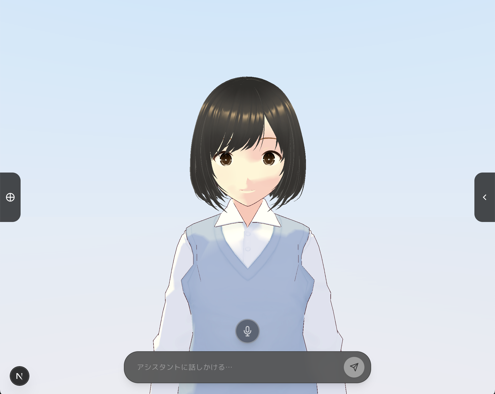

# AISTalk Demo (OSS)

VRMアバターと会話できるAIチャットシステムのデモです。

技術スタック：
- Next.js
- Go
- Unity WebGL
- GCP
- Aivis TTS

公開デモ：
https://demo.aisence.jp/

> [!NOTE]
> このリポジトリをクローンしただけではデモを起動できません。
> Unity WebGLビルド成果物は、容量およびライセンス上の理由からリポジトリには含めていません。
> 動作確認は公開デモサイトをご利用ください。




## 構成

| ディレクトリ | 説明 |
|---|---|
| `frontend/` | Next.js チャット UI・Unity iframe 連携 |
| `backend/` | Go API（チャット・モーション・Aivis TTS） |
| `AivisSpeechEngine/` | ローカル Aivis エンジン用 Docker/Makefile |

## クイックスタート

### Backend

```bash
cd backend
cp .env.example .env
# OPENAI_API_KEY を設定
go run .
# http://localhost:50037
```

### Frontend

```bash
cd frontend
cp .env.example .env
npm install
npm run dev
# http://localhost:3000
```

### ローカル Aivis（任意）

[AivisSpeechEngine/README.md](./AivisSpeechEngine/README.md) を参照。`127.0.0.1:10101` で起動。

### VRM / Unity

- VRM: `frontend/public/models/` に `self.vrm` / `avatar.vrm` を配置（`.gitignore` 対象）
- Unity WebGL: `frontend/public/unity/` に配置（`.gitignore` 対象）。デプロイ時は GCS から取得（手動アップロード）
